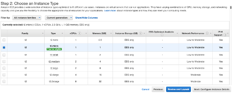
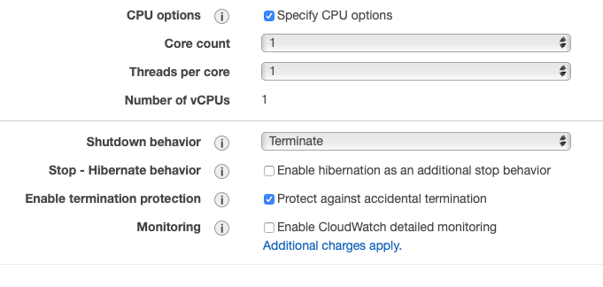
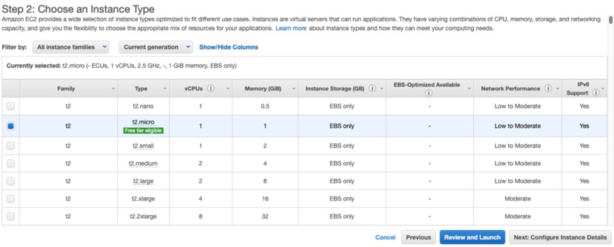
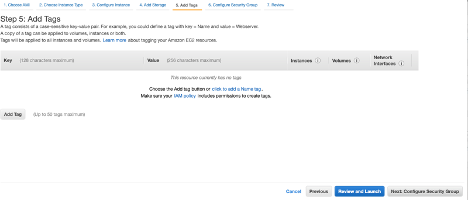
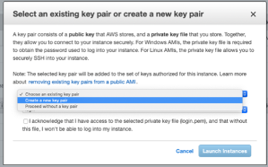
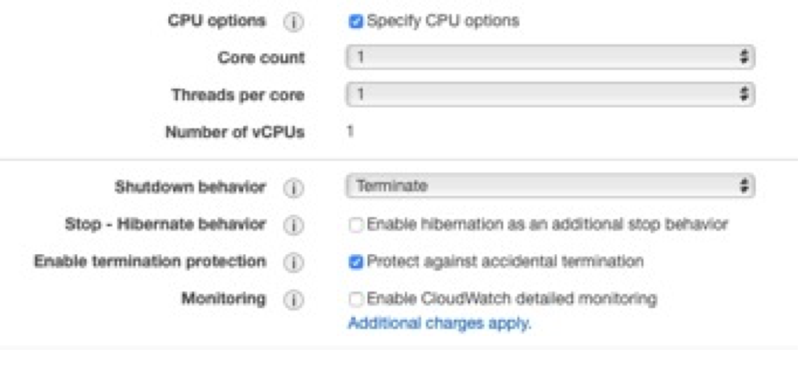
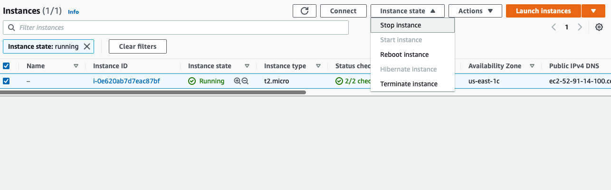
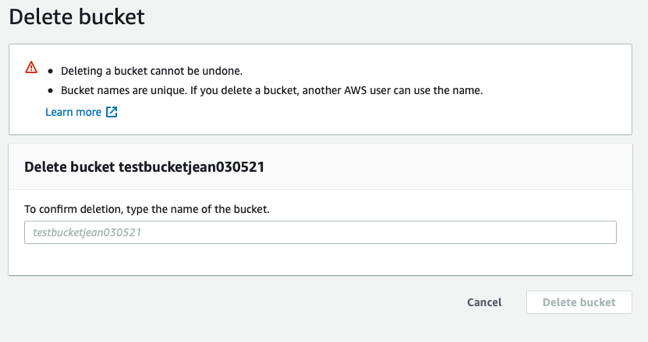

# Creating an EC2 instance

1.  Sign in to the AWS Management Console:
    <https://141650580409.signin.aws.amazon.com/console>

2.  Navigate to the EC2 console: <https://console.aws.amazon.com/ec2/>
    or click below:

{width="3.772276902887139in"
height="2.139235564304462in"}

3.  Choose **Launch instance**

{width="6.5in" height="2.433333333333333in"}

4.  If you are planning to run a Docker container, it is a good idea to
    search for instances with Docker pre-installed. The same goes for
    any other software that you intend to use. Search for **Docker** in
    the search bar, then select any instance that you prefer:

{width="6.5in" height="2.417361111111111in"}

5.  Choose the instance type, then click Review and Launch.

**Note:** For bioinformatics analyses (e.g. Tourmaline), t2-nano and
t2-micro are way too slow and definitely not sufficient. Here is a
detailed list of the CPU, memory, storage and network performance for
EC2/EMR instances: <https://aws.amazon.com/ec2/instance-types/>.

{width="6.5in" height="2.6222222222222222in"}

> Example specifications from
> <https://aws.amazon.com/ec2/instance-types/>. Note that there are
> other types of instances besides t2 (e.g. T3, M4 etc).

  Instance     vCPU\*   CPU Credits / hour   Mem (GiB)    Storage   Network Performance
  ------------ -------- -------------------- ----------- ---------- ---------------------
  t2.nano      1        3                    0.5         EBS-Only   Low
  t2.micro     1        6                    1           EBS-Only   Low to Moderate
  t2.small     1        12                   2           EBS-Only   Low to Moderate
  t2.medium    2        24                   4           EBS-Only   Low to Moderate
  t2.large     2        36                   8           EBS-Only   Low to Moderate
  t2.xlarge    4        54                   16          EBS-Only   Moderate
  t2.2xlarge   8        81                   32          EBS-Only   Moderate

6.  In the next screen, you can configure your instance, for example,
    you can specify the number of cores and threads and more by checking
    on **Specify CPU options**

{width="6.5in" height="2.4965277777777777in"}

7.  In the Specify CPU options window, you can click on the
    Information (i) button to learn more about each option.

{width="4.623762029746282in"
height="2.199744094488189in"}

8.  You can also configure the **storage device** on the instance. More
    information at:
    <https://docs.aws.amazon.com/emr/latest/ManagementGuide/emr-plan-storage.html>

{width="6.051337489063867in"
height="2.455446194225722in"}

9.  \[Optional\]: Add **Tags** to your instance.

{width="6.5in" height="2.7784722222222222in"}

10. \[Important\]: **Configure security groups**. By default, the rule
    accepts inbound SSH connections on port 22 from all IP addresses
    (0.0.0.0/0). It is recommended that you change this to restrict SSH
    connections from your IP address only. To do that, click on the Drop
    down menu, then select "**My IP**". The default address (0.0.0.0/0)
    should be replaced by your IP address. Click "Review and Launch" to
    launch your instance.

{width="6.5in" height="2.66875in"}

11. In the next screen, you will be prompted to select a key pair or
    create a new key pair if you haven't already.

{width="4.1584153543307085in"
height="2.5834612860892388in"}

12. If creating a new key pair, you can name your key pair and download
    the key pair, then click "**Launch Instance**"

It looks like only **pem** key pairs (for OpenSSH in MacOS/Unix
platforms) can be created and downloaded on the fly. If you are using
PuTTY for Windows, Mac, or other OS, you will need the key pair in
PuTTY's proprietary **ppk** format -- refer to the Appendix for creating
a key pair in the EC2 console.

{width="4.089108705161855in"
height="3.0296576990376205in"}

13. Your instance will start and will be ready once the status changes
    to "Running":

{width="5.407643263342083in"
height="2.881187664041995in"}

#  Set up a SSH connection to the master node

1.  You can connect to your instance using SSH to run commands and load
    your docker container. For this, you will need your **keypair file**
    and the appropriate permissions set to it so that only you can read
    the keypair file, e.g.: chmod 400 keypairname.pem. If you do not set
    these permissions, you will get an Unprotected Private Key File
    error when connecting to your EC2/EMR instance (Refer to the
    Appendix).

2.  Login to your **public IPv4 DNS address** as **ec2-user** with your
    **keypair** file, e.g:

ssh -i mykeypair.pem <ec2-user@ec2-52-91-14-100.compute-1.amazonaws.com>

{width="5.934465223097113in"
height="2.0891097987751532in"}

3.  Type **yes** to respond to the prompt on the ECDSA key fingerprint,
    and you're in!

{width="6.5in" height="3.0902777777777777in"}

4.  Since Docker is already pre-installed, you can just run your Docker
    commands, e.g.

docker pull aomlomics/tourmaline

docker run -v \$HOME:/data/ -it aomlomics/tourmaline

5.  Make sure your data is backed up -- read on to find out more:

# Creating a bucket for data upload/storage

> Full tutorial:
> <https://docs.aws.amazon.com/AmazonS3/latest/userguide/create-bucket-overview.html>
>
> To upload your data to Amazon S3, you must first create an Amazon S3
> bucket in one of the AWS Regions. The AWS account that creates the
> bucket owns it. You can upload any number of objects to the bucket.

1.  Sign in to the AWS Management Console:
    <https://141650580409.signin.aws.amazon.com/console>

2.  Navigate to the S3 console: <https://console.aws.amazon.com/s3/> or
    click below:

> {width="3.287128171478565in"
> height="1.8641119860017499in"}

3.  Click "Create bucket":

> {width="6.5in" height="2.3868055555555556in"}

4.  **Name** your bucket. After you create a bucket, you cannot change
    its name or region.

-   Bucket names must be between 3 and 63 characters long.

-   Bucket names can consist only of lowercase letters, numbers, dots
    (.), and hyphens (-). However, Amazon recommends that dots should be
    avoided.

-   Bucket names must begin and end with a letter or number.

-   More rules at:
    <https://docs.aws.amazon.com/AmazonS3/latest/userguide/bucketnamingrules.html>

{width="5.227722003499562in"
height="3.0534142607174104in"}

5.  In **Region,** choose an AWS region close to you to minimize latency
    and costs and address regulatory requirements. Objects stored in a
    Region never leave that Region unless you explicitly transfer them
    to another Region.

6.  In Bucket settings for Block Public Access, choose the **Block
    Public Access** settings that you want to apply to the bucket. We
    recommend that you keep all settings enabled unless you know that
    you need to turn off one or more of them for your use case, such as
    to host a public website. For more information, see
    <https://docs.aws.amazon.com/AmazonS3/latest/userguide/access-control-block-public-access.html>

> {width="5.643564085739283in"
> height="3.5236100174978127in"}

7.  \[Optional but highly recommended\] Enable bucket versioning
    (<https://docs.aws.amazon.com/AmazonS3/latest/userguide/Versioning.html>)

{width="6.40165135608049in"
height="1.6831681977252844in"}

8.  Click **Create Bucket**

# AWS command line interface (CLI) 

> To transfer data between your S3 bucket and Amazon EMR, you will need
> to use the **AWS command line interface (CLI)** pre-installed on the
> instance.
>
> AWS CLI is a unified tool to manage your AWS services. You can also
> download AWS CLI (<https://aws.amazon.com/cli/>) on your local
> computer. So, instead of clicking through the web console, you can
> perform all actions in this tutorial using the AWS command line
> interface (CLI). With just one tool to download and configure, you can
> control multiple AWS services from the command line and automate them
> through scripts.

#  aws configure 

> Full tutorial:
> <https://docs.aws.amazon.com/cli/latest/userguide/cli-configure-quickstart.html>
>
> When you use AWS CLI for the first time, you will need to set it up by
> typing aws configure. When you enter this command, the AWS CLI prompts
> you for four pieces of information:
>
> **\#1 and \#2: Access key ID and secret access key**
>
> If you are a root user, you can create access keys for yourself using
> the instructions in the tutorial above. Note that you can only
> download the key pair **once**, so keep the information in a secure
> place.
>
> **\#3: AWS Region**
>
> You can get this information from the master public DNS, if you
> already have an instance running. In the example below, the region is
> **us-east-2**
>
> {width="3.6430555555555557in"
> height="1.6039599737532808in"}
>
> **\#4: Output format**
>
> The Default output format specifies how the results are formatted. The
> value can be any of the values in the following list. If you don\'t
> specify an output format, json is used as the default.

-   **json** -- The output is formatted as a JSON string.

-   **yaml** -- The output is formatted as a YAML string. (Available in
    the AWS CLI version 2 only.)

-   **yaml-stream** -- The output is streamed and formatted as a YAML
    string. Streaming allows for faster handling of large data types.
    (Available in the AWS CLI version 2 only.)

-   **text** -- The output is formatted as multiple lines of
    tab-separated string values. This can be useful to pass the output
    to a text processor, like grep, sed, or awk.

-   **table** -- The output is formatted as a table using the characters
    +\|- to form the cell borders. It typically presents the information
    in a \"human-friendly\" format that is much easier to read than the
    others, but not as programmatically useful.

    1.  #  Access files in S3 bucket from an AWS instance 

> AWS CLI is useful for backing up data from your AWS instance to a S3
> bucket or to transfer files from S3 bucket to your instance. Here is a
> list of useful commands you can run after you have set up a SSH
> connection to your master node:

-   List all buckets available: aws s3 ls

-   List contents of a bucket: aws s3 ls testbucketjean030521

-   Copy files from bucket to local machine: aws s3 cp
    s3://testbucketjean030521/panda.ipynb var/lib/jupyter/home/jovyan/

-   Copy all files and folders recursively: aws s3 cp . s3://
    testbucketjean030521 \--recursive

-   Sync a local directory with a bucket. Note that this Sync does not
    > copy the existing files and folders from the local machine to the
    > bucket. It just copies the files which have been newly created or
    > modified: aws s3 sync . s3:// testbucketjean030521

# Clean up Amazon EC2 Resources

Once you are done with your work, remember to terminate the cluster and
empty/delete your designated Amazon S3 bucket to avoid additional
charges.

#  Terminate the EC2 instance

1.  If you had enabled **Termination Protection**, you will need to
    disable it before you can terminate your instance. On the EC2
    console, select your instance, then click on **Actions** -\>
    **Instance settings** -\> **Change termination protection**

{width="6.5in" height="1.8763888888888889in"}

2.  Uncheck the "enable" checkbox then click Save

{width="6.5in" height="3.0034722222222223in"}

3.  Now you can terminate your instance by selecting it, then clicking
    on **Instance state** -\> **Terminate Instance**. You can also stop,
    reboot, or hibernate your instance here.

{width="6.5in" height="1.0986111111111112in"}

4.  This will bring up the Terminate cluster prompt. Click on "Change"
    to turn off termination protection:

    1.  #  Empty/delete your S3 bucket

> Full instructions here:
> <https://docs.aws.amazon.com/AmazonS3/latest/userguide/creating-buckets-s3.html>

1.  Sign in to the AWS Management Console and open the Amazon S3 console
    at <https://console.aws.amazon.com/s3/>.

2.  In the Buckets list, select the option next to the name of the
    bucket that you want to delete, and then choose **Empty** or
    **Delete** at the top of the page.

{width="5.0in" height="1.9925207786526684in"}

3.  If you are deleting your bucket, confirm that you want to delete the
    bucket by entering the bucket name into the text field, and then
    choose Delete bucket.

{width="5.059027777777778in"
height="2.485148731408574in"}

**Note:** When you delete a bucket that has S3 Bucket Versioning
enabled, all versions of all the objects in the bucket are permanently
deleted.

# Appendix -- Create PEM and PPK format key pairs {#appendix-create-pem-and-ppk-format-key-pairs .list-paragraph}

Full tutorial:
<https://docs.aws.amazon.com/AWSEC2/latest/UserGuide/ec2-key-pairs.html>

A key pair, consisting of a **public** key and a **private** key, is a
set of security credentials that you use to prove your identity when
connecting to an instance. When your instance boots for the first time,
the content of the public key that you specified at launch is placed on
your Linux instance in an entry within \~/.ssh/authorized_keys. When you
connect to your instance using SSH, to log in you must specify the
private key that corresponds to the public key content. You use the
private key, instead of a password, to securely access your instances.
If you plan to connect to the instance using SSH, you must specify a key
pair.

14. Sign in to the AWS Management Console:
    <https://141650580409.signin.aws.amazon.com/console>

15. Navigate to the EC2 console: <https://console.aws.amazon.com/ec2/>
    or click below:

{width="3.772276902887139in"
height="2.139235564304462in"}

16. In the navigation pane, under Network & Security, choose Key Pairs
    and click "**Create key pair**":

> {width="6.5in" height="2.033333333333333in"}

17. For **Name**, enter a descriptive name for the key pair. Amazon EC2
    associates the public key with the name that you specify as the key
    name. A key name can include up to 255 ASCII characters. It can't
    include leading or trailing spaces.

> {width="5.475247156605424in"
> height="3.873619860017498in"}
>
> If you are using PuTTY for Windows, Mac, or other OS, choose ppk
> format. For other SSH clients, pem is probably the safer bet.

18. For **File format**, choose the format in which to save the private
    key. To save the private key in a format that can be used with
    OpenSSH, choose pem. To save the private key in a format that can be
    used with PuTTY, choose ppk.

19. Choose **Create key pair**.

20. The private key file is automatically downloaded by your browser.
    The base file name is the name you specified as the name of your key
    pair, and the file name extension is determined by the file format
    you chose. Save the private key file in a safe place.

> Important: **This is the only chance for you to save the private key
> file**.

21. If you will use an SSH client on a macOS or Linux computer to
    connect to your Linux instance, use the following command to set the
    permissions of your private key file so that only you can read it,
    e.g.: chmod 400 keypairname.pem

> If you do not set these permissions, then you will get the following
> error when connecting to your EC2/EMR instance:
>
> {width="6.5in"
> height="1.8854166666666667in"}
>
> Other connection errors can be troubleshooted here:
> <https://docs.aws.amazon.com/AWSEC2/latest/UserGuide/TroubleshootingInstancesConnecting.html#troubleshoot-unprotected-key>
